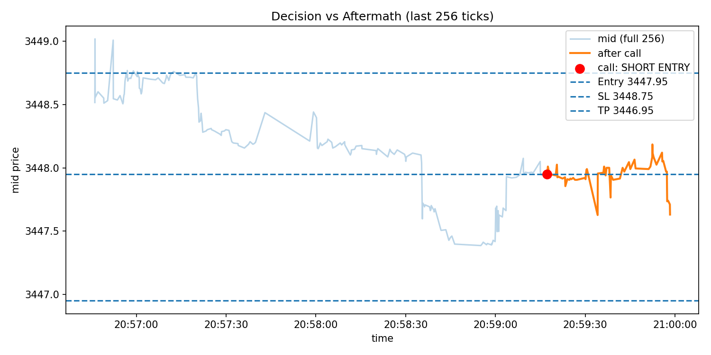

## QuantAlpha: Financial Deep Learning Forecasting (Gold XAUUSD)

An end-to-end pipeline that fuses macro forecasting (Prophet + TCN) with microstructure tape-reading (SAGAN discriminator) to produce actionable intraday trade guidance for XAUUSD (Spot Gold).

At a glance, the pipeline:
- Loads your trained macro models (Prophet, TCN v1, TCN v2) on daily OHLC to vote LONG/SHORT/NONE with confidence.
- Runs a trained SAGAN discriminator on the last 256 ticks to detect BUY/SELL/NEUTRAL microstructure and flag abnormal regimes (OOD) for risk control.
- Fuses macro + micro into a decision: LONG ENTRY, SHORT ENTRY, WAIT, or NO TRADE (if OOD).
- Suggests entry/SL/TP levels and saves an overlay plot and a JSON summary under `logs/`.


## Repository structure

Key folders and files you will use most:

- `src/`
	- `main.py` — the fully integrated pipeline. Run this after placing models and data.
	- `data/` — place your inference data here
		- `recent_daily_prices_Jan_July.csv` — sample daily OHLC(+ Change_%)
		- `recent_ticks_*.csv` — sample tick files with Bid/Ask/Volumes
	- `models/` — put trained models here for inference
		- `prophet/prophet_model.joblib`
		- `tcn/tcn_v1_baseline.keras`, `tcn/tcn_v2_improved.keras`, `tcn/tcn_v2_improved.joblib` (scaler)
		- `sagan/D_SAGAN_L256_E50.pt`

- `model_training/` — notebooks to train Prophet, TCNs, and SAGAN in Google Colab
	- `(Prophet + TCN)_Nay/Prophet_Nay/Prophet_Spot_Gold_Forecasting.ipynb`
	- `(Prophet + TCN)_Nay/TCN_Nay/tcn_v1_/tcn_v1_.ipynb`
	- `(Prophet + TCN)_Nay/TCN_Nay/tcn_v2/tcn_v2_improved.ipynb`
	- `sagan/sagan.ipynb` (+ experiment artifacts)

- `logs/` — automatic run outputs
	- `gold_pipeline_YYYYMMDD_HHMMSS/summary.json`, `figs/overlay_*.png`, `summary.log`

- `requirements.txt` — Python dependencies for local inference and notebook work.


## Python environment

- Recommended: Python 3.10 or 3.11
- Install dependencies:

```bash
# macOS / zsh
python3 -m venv .venv
source .venv/bin/activate
pip install --upgrade pip
pip install -r requirements.txt
```

Notes for macOS (Apple Silicon):
- If standard `tensorflow` wheels are problematic, consider:
	- `pip install tensorflow-macos tensorflow-metal`
	- Keep `keras-tcn` installed as per requirements; ensure TF >= 2.13.
- Prophet requires a working C++ toolchain (Xcode CLT) and pystan under the hood; the pinned wheel should work on recent macOS.


## Train models in Google Colab (zip-and-run)

All model training should be done in Google Colab. The repo includes notebooks and pinned requirement files per model. Typical workflow:

1) Zip and upload the training folder
	 - Zip either the entire `model_training/` or the specific subfolder you need (Prophet/TCN/SAGAN).
	 - Upload to Colab (or mount Google Drive) and unzip.

2) Install the notebook-specific requirements
	 - Prophet: `model_training/(Prophet + TCN)_Nay/Prophet_Nay/requirements_prophet.txt`
	 - TCN v1: `model_training/(Prophet + TCN)_Nay/TCN_Nay/tcn_v1/requirements_tcn_v1_baseline.txt`
	 - TCN v2: `model_training/(Prophet + TCN)_Nay/TCN_Nay/tcn_v2/requirements_tcn_v2.txt`
	 - Ensemble (optional): `model_training/(Prophet + TCN)_Nay/Ensemble_Nay/requirements_ensemble.txt`
	 - SAGAN: install packages directly in `sagan.ipynb` as prompted.

3) Run the notebooks to train and export artifacts
	 - Prophet: export a `.joblib` model.
	 - TCN v1 & TCN v2: export `.keras` model(s) and the fitted `scaler` as `.joblib`.
	 - SAGAN: export the discriminator checkpoint, e.g. `D_SAGAN_L256_E50.pt`.

4) Copy trained artifacts back into this repo for inference
	 Place files with these exact names/paths (or adjust paths in `src/main.py`):
	 - `src/models/prophet/prophet_model.joblib`
	 - `src/models/tcn/tcn_v1_baseline.keras`
	 - `src/models/tcn/tcn_v2_improved.keras`
	 - `src/models/tcn/tcn_v2_improved.joblib` (the scaler used at TCN training)
	 - `src/models/sagan/D_SAGAN_L256_E50.pt`


## Data expected for inference

Daily prices (for macro models):
- File: `src/data/recent_daily_prices_Jan_July.csv` (you can supply your own)
- Required columns: `Date`, `Open`, `High`, `Low`, `Close`, `Change_%`
- The TCN input builder uses a last-20 window and the columns above.

Ticks (for microstructure):
- File: `src/data/recent_ticks_*.csv`
- Required columns: `Gmt time`, `Ask`, `Bid`, `AskVolume`, `BidVolume`
- The micro module uses the last 256 ticks, engineering 10 features for the discriminator.


## How to run the pipeline (`src/main.py`)

Before running, review these in `src/main.py` and adjust if needed:
- Paths: `DAILY_PATH`, `TICK_SOURCE_PATH`, `PROPHET_PATH`, `TCN_V1_PATH`, `TCN_V2_PATH`, `SCALER_PATH`, `DISCRIMINATOR_PATH`.
- Feature order: `FEATURE_ORDER` must match the order used to train your SAGAN discriminator.
- Discriminator baseline: `MU_D` and `SIGMA_D` should be calibrated (see below).
- Decision index: `DECISION_IDX_FOR_REVIEW = 200` controls where the “call” is made inside the 256-tick window for visualization.
- Risk/Reward: `RISK_USD_PER_OZ`, `REWARD_USD_PER_OZ` for SL/TP suggestion.

Run it:

```bash
python src/main.py
```

What it does:
1) Macro module (Prophet + TCNs) on daily data → `macro_bias` (LONG/SHORT/NONE) + confidence.
2) Micro module (SAGAN discriminator) on last 256 ticks → `micro_signal` (BUY/SELL/NEUTRAL) and `risk_state` (NORMAL/HIGH_RISK_OOD).
3) Fusion → action: LONG ENTRY, SHORT ENTRY, WAIT, or NO TRADE (if HIGH_RISK_OOD).
4) Level suggestions (Entry/SL/TP) and overlay plot.
5) Artifacts saved under `logs/gold_pipeline_YYYYMMDD_HHMMSS/`:
	 - `summary.log` — console output
	 - `summary.json` — structured output (macro/micro/decision/levels)
	 - `figs/overlay_<action>.png` — visualization of the decision window


## Calibrating the discriminator (MU_D, SIGMA_D)

`MU_D` and `SIGMA_D` represent the mean and standard deviation of the discriminator score on a large set of real, in-distribution windows. To calibrate:
- Collect many 256-tick windows from your real training regime.
- Run the trained discriminator on each window; record the scalar score.
- Compute mean and std over that collection and set `MU_D`, `SIGMA_D` in `main.py`.
- The risk check flags OOD when `disc_score < MU_D - 2 * SIGMA_D` by default.


## Troubleshooting

- “Prophet/TCN model not found” warnings
	- The pipeline will still run, but macro bias may degrade to `NONE` (LOW confidence).
	- Ensure model files are placed under `src/models/...` as listed above.

- TensorFlow issues on macOS
	- Try `tensorflow-macos` and `tensorflow-metal`. Ensure `keras-tcn` is installed.
	- You can also skip TCNs (they’ll be `None`) to test other parts of the pipeline.

- Feature channel mismatch errors
	- If you see `Feature '<name>' not found`, ensure the tick CSV has expected columns and your `FEATURE_ORDER` matches training.

- Not enough data
	- TCN input needs at least 20 daily rows. Micro block needs ≥256 ticks.


## FAQ

Q: Can I pass arguments to `main.py`?
- Not yet. Paths and thresholds are module-level constants. Edit them in `src/main.py` to suit your setup.

Q: Can I change where outputs go?
- Yes, see `ensure_run_dir()` in `main.py`. It currently writes under `logs/gold_pipeline_<timestamp>/`.

Q: How do I use a different discriminator checkpoint?
- Replace the file at `src/models/sagan/D_SAGAN_L256_E50.pt` and keep `FEATURE_ORDER` consistent with the training channels.


## Next steps (optional)

- Add a CLI wrapper to set paths and parameters without editing code.
- Add a small calibration script to compute `MU_D`/`SIGMA_D` automatically on a folder of windows.
- Introduce unit tests around feature engineering and fusion rules.
- Extend data ingestion to live feeds (e.g., WebSocket) and write a rolling buffer for 256-tick windows.


## Citation and credits

- Time-series forecasting: Facebook Prophet, TCN architectures (`keras-tcn`).
- Adversarial microstructure modeling: SAGAN-inspired discriminator with self-attention.

If you use or adapt this pipeline for research, please credit the original notebooks under `model_training/`.


## Example output and figure

Below is a shortened example of what you’ll see in the console and what gets saved to `logs/gold_pipeline_<timestamp>/`.

Console (excerpt):

```text
=== MACRO MODULE ===
macro_bias: LONG
macro_confidence: MEDIUM
detail: { 'Prophet_vote': 'BUY', 'TCN_v1_vote': 'BUY', 'TCN_v2_vote': 'SELL', ... }

=== MICRO MODULE ===
risk_state: NORMAL
micro_signal: BUY
pressure_notes: strong bid imbalance, mid drifting up
disc_score: 0.81

=== FINAL DECISION ===
action: LONG ENTRY
confidence: MEDIUM
reason: Macro bullish + local buy pressure + normal regime

Suggested Entry: 2405.12
Stop Loss: 2404.32
Take Profit: 2406.12
```

JSON summary (excerpt):

```json
{
	"macro": { "macro_bias": "LONG", "macro_confidence": "MEDIUM", "detail": { "last_close": 2404.55, "prophet_pred": 2405.20, "tcn1_pred": 2406.01, "tcn2_pred": 2403.90 } },
	"micro": { "risk_state": "NORMAL", "micro_signal": "BUY", "pressure_notes": "strong bid imbalance, mid drifting up", "disc_score": 0.81, "ref_mid": 2405.12 },
	"decision": { "action": "LONG ENTRY", "confidence": "MEDIUM", "reason": "Macro bullish + local buy pressure + normal regime" },
	"levels": { "entry": 2405.12, "stop_loss": 2404.32, "take_profit": 2406.12 },
	"artifacts": { "summary_log": "logs/gold_pipeline_YYYYMMDD_HHMMSS/summary.log", "figure": "logs/gold_pipeline_YYYYMMDD_HHMMSS/figs/overlay_long_entry.png" }
}
```

Figure (example from a prior run):



Note: Your timestamped folder and overlay filename will vary depending on the final action (`overlay_long_entry.png`, `overlay_short_entry.png`, `overlay_wait.png`, or `overlay_no_trade.png`).
# QuantAlpha